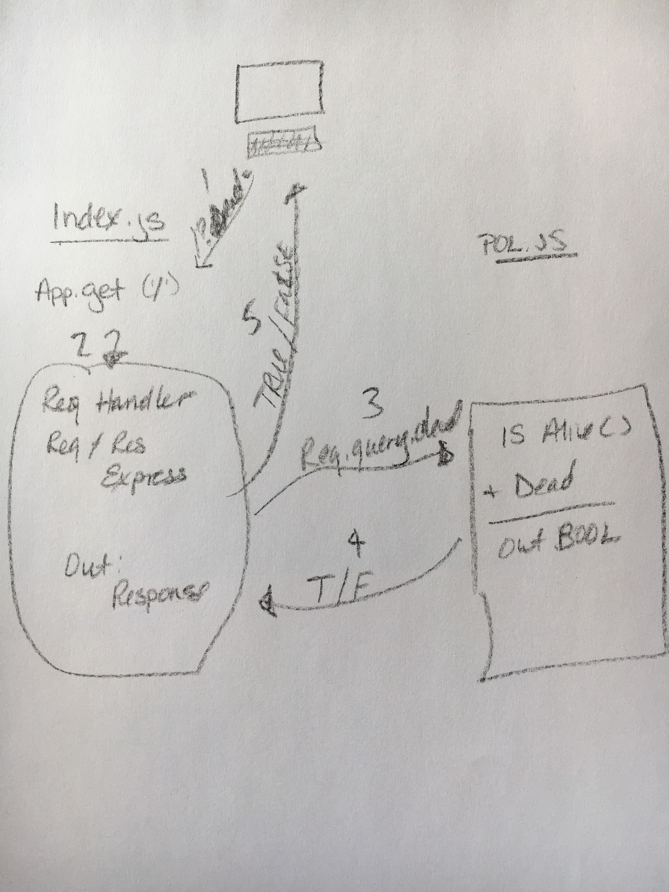

# LAB - 00

## Proof of Life Server

### Author: Randee orion

### Links and Resources

- [submission PR](https://github.com/randee-401-advanced-javascript/lab-00/pull/1)
- [ci/cd](https://travis-ci.com/github/randee-401-advanced-javascript/lab-00/builds/153419195) (GitHub Actions)
- [front-end application](nhttps://randeelab-oo.herokuapp.com/a)

- [jsdocs](https://randeelab-oo.herokuapp.com/docs/)
### Setup

#### `.env` requirements (where applicable)

i.e.

- `PORT` - Port Number
- `MONGODB_URI` - URL to the running mongo instance/db

#### How to initialize/run your application (where applicable)

-  `npm start`
- Endpoint `/`
  * returns a boolean 
- Endpoint `/`
  * returns a JSDoc Documentation Pages

#### How to use your library (where applicable)

#### Tests

* Unit Tests: `npm test`
* Lint Tests: `npm run lint`

#### UML

